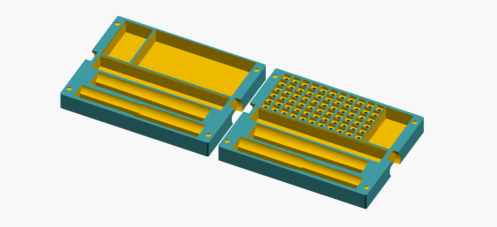

# This is a box for TS100 soldering iron with some accessories and space for a USB C PD Powerbank

__Note:__ This box/case is derived from my keebcu projects keebCase.scad.

## Box for ES120 screw driver and 4mm hex bits

# LICENSE

<dl>
 Dieses Werk ist lizenziert unter einer <a rel="license" href="http://creativecommons.org/licenses/by/4.0/">Creative Commons Namensnennung 4.0 International Lizenz</a>.
</dl>

<dl>
 This work is licensed under a <a rel="license" href="http://creativecommons.org/licenses/by/4.0/">Creative Commons Attribution 4.0 International License</a>.
</dl>
